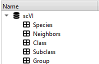

# Sunburst plot

Sunburst plot viewer plugin for [ManiVault](https://github.com/ManiVaultStudio/core/). Based on the [Zoomable sunburst](https://observablehq.com/@d3/zoomable-sunburst) diagram and [Sunburst](https://observablehq.com/@d3/sunburst/2) diagram [D3](https://d3js.org/) implementations.

```bash
git clone git@github.com:ManiVaultStudio/SunburstClusterPlugin.git
```


<p align="middle">
  
   
  <center>
  Sunburst plot (top) based on a data hierarchy (bottom right). Hierarchy levels (clusters) can be selectively shown (bottom left). <small>Data: 
<a href="https://alleninstitute.github.io/HMBA_BasalGanglia_Consensus_Taxonomy/">Mammalian Basal Ganglia Consensus Cell Type Atlas</a>
</small>
  </center>
</p>


## How to use

You'll need:
- A point data set
- At least one cluster data set child
    - All cluster data sets must cover the base point data fully and unambiguously (each data point must belong to exactly one cluster)
    - The order of cluster data sets in the data hierarchy determines the order in the plot: the first cluster data is the innermost ring

To open the plot:
- Right-click on the point data set in the data hierarchy, select `View` `->` `Sunburst plot`
- OR: Open an empty sunburst plot via the main toolbar: `View` `->` `Sunburst plot` and drag a point data set (with cluster data children) into the plot widget

<p align="middle">
  
   
  <center>
  Hovering over a partition will show a tooltip with the full hierarchy path and number of elements in the focussed partition (left). Multiple partitions can be selected while holding `Ctrl` and left-clicking with the mouse (right).
  </center>
</p>

Other interactions:
- Use the `mouse wheel` to zoom, click the left `mouse button` and drag to pan and click the `mouse wheel` to reset the view
- In the `Focus view` mode, only two hierarchy levels are shown. Clicking a partition will zoom into this part of the hierarchy. Select a partition with `Ctrl` + left `mouse button`. Move back to the overview by clicking the center. De-select all by `Ctrl` + clicking the center.

<center>
<video width="420" autoplay loop muted>
  <source src="docs/figs/static_zoom_change.mp4" type="video/mp4" />
</video>

Switching between static overview and dynamic focus view will retain the selection.
</center>